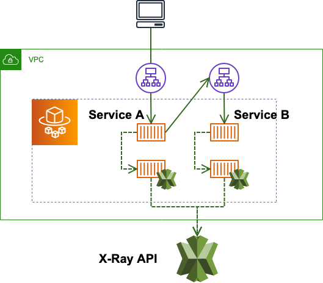
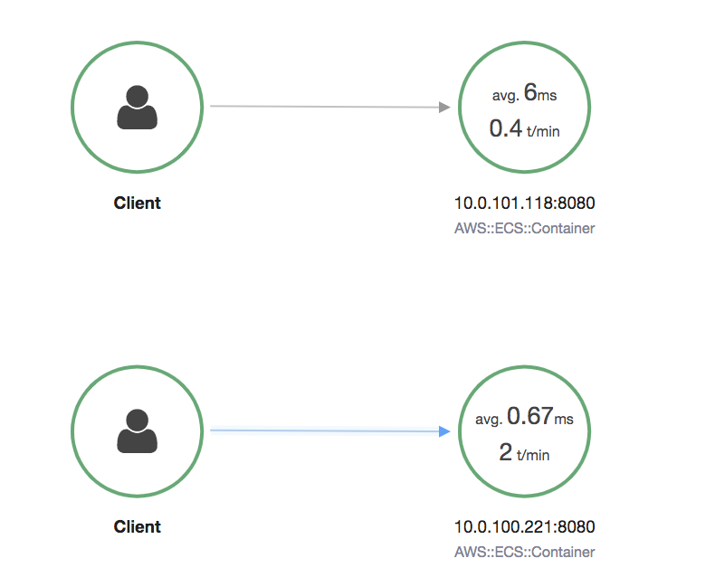
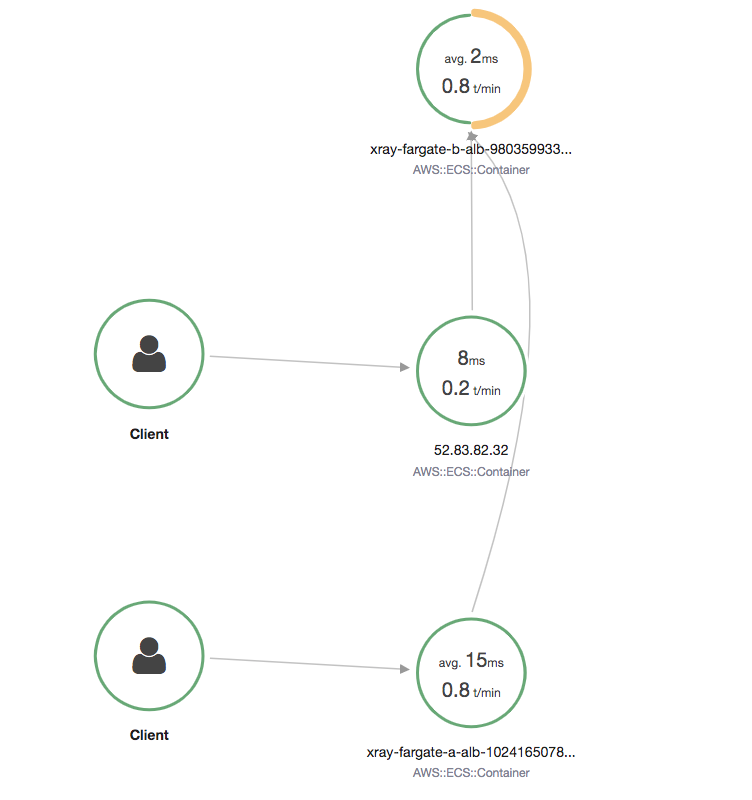
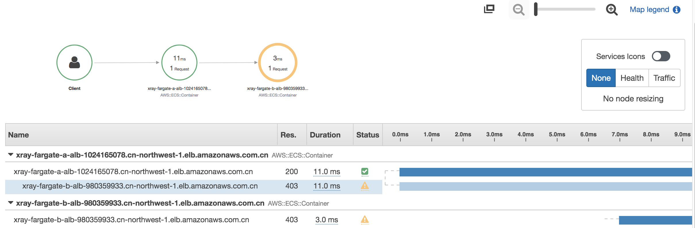

## Run AWS X-Ray as a sidecar container on Fargate for application tracing

[Sample demo](https://github.com/aws-samples/aws-xray-fargate)

[java-scorekeep sample](https://github.com/aws-samples/eb-java-scorekeep/tree/xray-ecs)

[Running the X-Ray daemon on Amazon ECS](https://docs.aws.amazon.com/xray/latest/devguide/xray-daemon-ecs.html)



## Deploy X-Ray as a sidecar container with application
1. Fargate IAM Role
```bash
export TASK_ROLE_ARN=$(aws iam get-role --role-name ecsTaskRole --query "Role.Arn" --output text --region ${AWS_REGION})
export TASK_EXECUTION_ROLE_ARN=$(aws iam get-role --role-name ecsTaskExecutionRole --query "Role.Arn" --output text --region ${AWS_REGION})
```

Attach the AWSXRayDaemonWriteAccess to ECS worker node Role
```bash
aws iam attach-role-policy --role-name $TASK_ROLE_ARN \
--policy-arn arn:aws-cn:iam::aws:policy/AWSXRayDaemonWriteAccess --region ${AWS_REGION}
```

2. Create Fargate cluster
```bash
git clone https://github.com/aws-samples/aws-xray-fargate.git

export cluster_name=xray-fargate
aws ecs create-cluster --cluster-name ${cluster_name} --region ${AWS_REGION}

ecs-cli configure --region ${AWS_REGION} --cluster ${cluster_name} --default-launch-type FARGATE --config-name container-demo


export vpc_id=vpc-00000000
export SUBNET_ID_1=subnet-11111111
export SUBNET_ID_2=subnet-22222222
export SUBNET_ID_3=subnet-22222222
export SG_ID=sg-111111
export ALB_SUBNET_ID_1=subnet-alb-11111111
export ALB_SUBNET_ID_2=subnet-alb-22222222
export ALB_SUBNET_ID_3=subnet-alb-22222222
export ALB_SG_ID=sg-22222

aws ec2 authorize-security-group-ingress --group-id $SG_ID --protocol tcp --port 80 \
--cidr 0.0.0.0/0 --region ${AWS_REGION}
aws ec2 authorize-security-group-ingress --group-id $SG_ID --protocol all --port all \
--source-group $SG_ID --region ${AWS_REGION}
aws ec2 authorize-security-group-ingress --group-id $ALB_SG_ID --protocol tcp --port 80 \
--cidr 0.0.0.0/0 --region ${AWS_REGION}
```

3. Build the x-ray daemon
```bash
# Create a folder and download the daemon.
cd src/xray-daemon

# Replace the Dockerfile with the following content.
FROM amazonlinux
RUN yum install -y unzip
RUN curl -o daemon.zip https://s3.cn-northwest-1.amazonaws.com.cn/aws-xray-assets.cn-northwest-1/xray-daemon/aws-xray-daemon-linux-3.x.zip
RUN unzip daemon.zip && cp xray /usr/bin/xray
ENTRYPOINT ["/usr/bin/xray", "-t", "0.0.0.0:2000", "-b", "0.0.0.0:2000"]
EXPOSE 2000/udp
EXPOSE 2000/tcp

# Build the image.
docker build -t xray-daemon .
ecs-cli push xray-daemon
export REGISTRY_URL_XRAY_DAEMON=$(aws ecr describe-repositories --repository-name xray-daemon \
--region ${AWS_REGION}| jq -r '.repositories[].repositoryUri')
```

3. Build ALB for service B
```bash
export B_LOAD_BALANCER_ARN=$(aws elbv2 create-load-balancer --name xray-fargate-b-alb \
--subnets $ALB_SUBNET_ID_1 $ALB_SUBNET_ID_2 $ALB_SUBNET_ID_3 --security-groups $ALB_SG_ID \
--region ${AWS_REGION} --scheme internet-facing --type application | jq -r '.LoadBalancers[].LoadBalancerArn')

export B_TARGET_GROUP_ARN=$(aws elbv2 create-target-group --name xray-fargate-b-tg \
--protocol HTTP --port 8080 --vpc-id $vpc_id --region ${AWS_REGION} \
--target-type ip --health-check-path /health | jq -r '.TargetGroups[].TargetGroupArn')

aws elbv2 create-listener --load-balancer-arn $B_LOAD_BALANCER_ARN --region ${AWS_REGION} \
--protocol HTTP --port 80 --default-actions Type=forward,TargetGroupArn=$B_TARGET_GROUP_ARN

export SERVICE_B_ENDPOINT=$(aws elbv2 describe-load-balancers --load-balancer-arn $B_LOAD_BALANCER_ARN \
--region ${AWS_REGION} | jq -r '.LoadBalancers[].DNSName')

```

4. Push Service A / B container to ECR
```bash
cd ./src/service-b/
docker build -t service-b .
ecs-cli push service-b
cd ../service-a/
docker build -t service-a .
ecs-cli push service-a

export REGISTRY_URL_SERVICE_B=$(aws ecr describe-repositories --repository-name service-b \
--region ${AWS_REGION}| jq -r '.repositories[].repositoryUri')
export REGISTRY_URL_SERVICE_A=$(aws ecr describe-repositories --repository-name service-a \
--region ${AWS_REGION}| jq -r '.repositories[].repositoryUri')

aws logs create-log-group --log-group-name /ecs/service-b --region ${AWS_REGION}
aws logs create-log-group --log-group-name /ecs/service-a --region ${AWS_REGION}
```

5. Create Farget Service-B

**Important: You can check the docker-compose.yml update the AWS region and update the x-ray image with REGISTRY_URL_XRAY_DAEMON** 

```bash
cd ../service-b/
# Important: You can check the docker-compose.yml update the AWS region and update the x-ray image with REGISTRY_URL_XRAY_DAEMON
envsubst < docker-compose.yml-template > docker-compose.yml
envsubst < ecs-params.yml-template > ecs-params.yml

# Deploy Farget Service-B
ecs-cli compose service up --deployment-max-percent 100 --deployment-min-healthy-percent 0 \
--target-group-arn $B_TARGET_GROUP_ARN --launch-type FARGATE --container-name service-b \
--container-port 8080 --cluster $cluster_name --region $AWS_REGION

# you can ignore the warning WARN[0000] Environment variable is unresolved. Setting it to a blank value...  key name=AWS_XRAY_DAEMON_ADDRESS

# View the running container
ecs-cli compose --cluster $cluster_name --project-name service-b \
service ps --cluster-config container-demo --region $AWS_REGION | grep service-b

# View logs by replace the task_id with above output
ecs-cli logs --cluster $cluster_name --task-id $task_id \
    --follow --cluster-config container-demo --region $AWS_REGION
```

6. Build ALB for service A
```bash
export A_LOAD_BALANCER_ARN=$(aws elbv2 create-load-balancer --name xray-fargate-a-alb \
--subnets $ALB_SUBNET_ID_1 $ALB_SUBNET_ID_2 $ALB_SUBNET_ID_3 --security-groups $ALB_SG_ID \
--scheme internet-facing --type application --region ${AWS_REGION}| jq -r '.LoadBalancers[].LoadBalancerArn')
export A_TARGET_GROUP_ARN=$(aws elbv2 create-target-group --name xray-fargate-a-tg --protocol HTTP \
--port 8080 --vpc-id $vpc_id --region ${AWS_REGION} --target-type ip \
--health-check-path /health | jq -r '.TargetGroups[].TargetGroupArn')
aws elbv2 create-listener --load-balancer-arn $A_LOAD_BALANCER_ARN --protocol HTTP \
--port 80 --default-actions Type=forward,TargetGroupArn=$A_TARGET_GROUP_ARN --region ${AWS_REGION}
```

7. Create Farget Service-A

**Important: You can check the docker-compose.yml update the AWS region and update the x-ray image with REGISTRY_URL_XRAY_DAEMON** 

```bash
cd ../service-a/
# Important: You can check the docker-compose.yml update the AWS region and update the x-ray image with REGISTRY_URL_XRAY_DAEMON
envsubst < docker-compose.yml-template > docker-compose.yml
envsubst < ecs-params.yml-template > ecs-params.yml

# Deploy Farget Service-A
ecs-cli compose service up --deployment-max-percent 100 --deployment-min-healthy-percent 0 \
--target-group-arn $A_TARGET_GROUP_ARN --launch-type FARGATE --container-name service-a \
--container-port 8080 --cluster $cluster_name --region $AWS_REGION

# you can ignore the warning WARN[0000] Environment variable is unresolved. Setting it to a blank value...  key name=AWS_XRAY_DAEMON_ADDRESS

# View the running container
ecs-cli compose --cluster $cluster_name --project-name service-a \
service ps --cluster-config container-demo --region $AWS_REGION | grep service-a

# View logs by replace the task_id with above output
ecs-cli logs --cluster $cluster_name --task-id $task_id \
    --follow --cluster-config container-demo --region $AWS_REGION
```

# Check the X-Ray Tracing
1. Get the service-a and service-b ALB DNS name

```bash
export SERVICE_B_ENDPOINT=$(aws elbv2 describe-load-balancers --load-balancer-arn $B_LOAD_BALANCER_ARN \
--region ${AWS_REGION} | jq -r '.LoadBalancers[].DNSName')
curl http://${SERVICE_B_ENDPOINT}/health

export SERVICE_A_ENDPOINT=$(aws elbv2 describe-load-balancers --load-balancer-arn $A_LOAD_BALANCER_ARN \
--region ${AWS_REGION} | jq -r '.LoadBalancers[].DNSName')
curl http://${SERVICE_A_ENDPOINT}/health
curl http://${SERVICE_A_ENDPOINT}/
```

2. Open the X-Ray console.

**Access the http://${SERVICE_B_ENDPOINT}/health and curl http://${SERVICE_A_ENDPOINT}/health**



**Access http://${SERVICE_A_ENDPOINT} will do a POST to the service b**



3. Send a request to Service A's ALB using Apache Bench

You can check the response of the request from the outside in the details of Trace.

```bash
ab -n 100 -c 10 http://${SERVICE_A_ENDPOINT}
```

**Access http://${SERVICE_A_ENDPOINT} will do a POST to the service b**



## Cleanup
```bash
aws elbv2 delete-load-balancer --load-balancer-arn $B_LOAD_BALANCER_ARN --region $AWS_REGION
aws elbv2 delete-load-balancer --load-balancer-arn $A_LOAD_BALANCER_ARN --region $AWS_REGION
aws elbv2 delete-target-group --target-group-arn $B_TARGET_GROUP_ARN --region $AWS_REGION
aws elbv2 delete-target-group --target-group-arn $A_TARGET_GROUP_ARN --region $AWS_REGION

aws ecr delete-repository --repository-name service-b --region $AWS_REGION
aws ecr delete-repository --repository-name service-c --region $AWS_REGION

aws logs delete-log-group --log-group-name /ecs/service-b --region $AWS_REGION
aws logs delete-log-group --log-group-name /ecs/service-a --region $AWS_REGION

cd src/service-a
ecs-cli compose --project-name service-a --cluster $cluster_name service rm --region $AWS_REGION
cd ../service-b
ecs-cli compose --project-name service-b --cluster $cluster_name service rm --region $AWS_REGION
```
