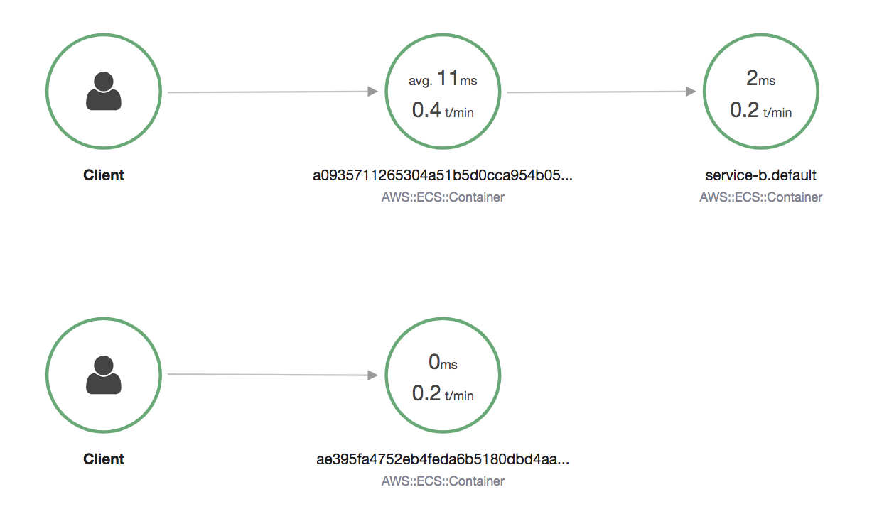
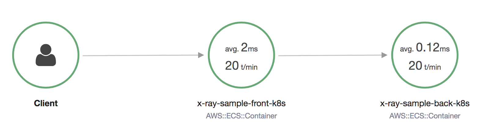

## Application Tracing on Kubernetes with AWS X-Ray

## Attach the AWSXRayDaemonWriteAccess to EKS worker node Role. Otherwise you need the ServiceAccount for AWSXRayDaemon

```bash
aws iam attach-role-policy --role-name $ROLE_NAME \
--policy-arn arn:aws-cn:iam::aws:policy/AWSXRayDaemonWriteAccess --region ${AWS_REGION}
```

## Deploy X-Ray DaemonSet
1. Build the X-Ray DaemonSet Docker image and push to ECR

### Dockerfile
```bash
FROM amazonlinux
# Download latest 2.x release of X-Ray daemon
# Unpack archive, by default unzip is not installed so do that beforehand
RUN yum install -y unzip && \
    cd /tmp/ && \
    curl https://s3.cn-northwest-1.amazonaws.com.cn/aws-xray-assets.cn-northwest-1/xray-daemon/aws-xray-daemon-linux-2.x.zip > aws-xray-daemon-linux-2.x.zip && \
		unzip aws-xray-daemon-linux-2.x.zip && \
		cp xray /usr/bin/xray && \
		rm aws-xray-daemon-linux-2.x.zip && \
    rm cfg.yaml

# Expose port 2000 on udp
EXPOSE 2000/udp
EXPOSE 2000/tcp

ENTRYPOINT ["/usr/bin/xray", "-t", "0.0.0.0:2000", "-b", "0.0.0.0:2000"]

# No cmd line parameters, use default configuration
CMD ['']
```

### Build the image.
```bash
docker build -t aws-xray-daemon .
ecs-cli push aws-xray-daemon
export REGISTRY_URL_XRAY_DAEMON=$(aws ecr describe-repositories --repository-name aws-xray-daemon \
--region ${AWS_REGION}| jq -r '.repositories[].repositoryUri')
echo $REGISTRY_URL_XRAY_DAEMON
```

2. Deploy the xray-daemon
```bash
git clone https://github.com/aws-samples/aws-xray-kubernetes.git
cd aws-xray-kubernetes/xray-daemon
## Modify the image location to REGISTRY_URL_XRAY_DAEMON and add the environment variables
          # env:
          #   - name: AWS_REGION
          #     value: cn-northwest-1

eksctl create iamserviceaccount --name xray-daemon \
--namespace kube-system --cluster eks-xray-demo \
--attach-policy-arn arn:aws-cn:iam::aws:policy/AWSXRayDaemonWriteAccess \
--approve --override-existing-serviceaccounts --region cn-northwest-1
# Then uncomment the next two lines and add your new role-arn.
  #annotations:
  #eks.amazonaws.com/role-arn: arn:aws:iam::AWS_ACCOUNT_ID:role/IAM_ROLE_NAME

kubectl apply -f xray-k8s-daemonset.yaml
kubectl describe daemonset xray-daemon
kubectl get pods -l app=xray-daemon -o wide
kubectl logs -l app=xray-daemon

kubectl describe services xray-service
```

By default, the X-Ray SDK expects the daemon to be available on 127.0.0.1:2000 and hosted within its own Pod as sider car

[Sample document](https://aws.amazon.com/blogs/compute/application-tracing-on-kubernetes-with-aws-x-ray/) guild you to Build the X-Ray daemon Docker image and deploy it.

## Deploy sample application
1. Connecting to the X-Ray daemon

The deployed X-Ray DaemonSet exposes all Pods via the Kubernetes service discovery, so applications can use this endpoint to discover the X-Ray daemon. If you deployed to the default namespace, the endpoint is: `xray-service.default`

Applications now need to set the daemon address either with the `AWS_XRAY_DAEMON_ADDRESS` environment variable to `xray-service.default:2000` (**preferred**) or directly within the SDK setup code: `AWSXRay.setDaemonAddress('xray-service.default:2000');`

To set up the environment variable, include the following information in your Kubernetes application deployment description YAML. 
```yaml
          env:
            - name: AWS_XRAY_DAEMON_ADDRESS 
              value: xray-service.default:2000
            - name: AWS_REGION
              value: cn-northwest-1
```

2. Deploy sample pods

```bash
# Update the aws-xray-kubernetes/demo-app/k8s-deploy.yaml the image URL
cd aws-xray-kubernetes/demo-app/
kubectl apply -f k8s-deploy.yaml

kubectl get pods -l app=service-a
kubectl logs -f -l app=service-a
kubectl exec -it service-a-pod sh
-> /usr/src/app # wget http://localhost:8080 -O -

kubectl get pods -l app=service-b
kubectl logs -f -l app=service-b
kubectl exec -it service-b-pod sh
-> /usr/src/app # wget http://localhost:8080/health -O -

service_a_alb=$(kubectl get service service-a -o json | jq -r '.status.loadBalancer.ingress[0].hostname')
service_b_alb=$(kubectl get service service-b -o json | jq -r '.status.loadBalancer.ingress[0].hostname')
curl http://$service_a_alb/health
curl http://$service_b_alb/health
curl http://$service_a_alb

# AB testing
ab -n 100 -c 10 http://${service_a_alb}
```



More example
```bash
# modify the aws-xray-kubernetes/demo-app/k8s-deploy.yaml to point to the ECR image
wget https://eksworkshop.com/intermediate/245_x-ray/sample-front.files/x-ray-sample-front-k8s.yml
kubectl apply -f x-ray-sample-front-k8s.yml
kubectl describe deployments x-ray-sample-front-k8s
kubectl get pods -l app=x-ray-sample-front-k8s -o wide

wget https://eksworkshop.com/intermediate/245_x-ray/sample-back.files/x-ray-sample-back-k8s.yml
kubectl apply -f x-ray-sample-back-k8s.yml
kubectl describe deployments x-ray-sample-back-k8s
kubectl get pods -l app=x-ray-sample-back-k8s -o wide

kubectl logs -l app=x-ray-sample-front-k8s
kubectl logs -l app=x-ray-sample-back-k8s

kubectl get service x-ray-sample-front-k8s -o wide

front_k8s_alb=$(kubectl get service x-ray-sample-front-k8s-o json | jq -r '.status.loadBalancer.ingress[0].hostname')
curl http://$front_k8s_alb

# Open Browser for http://$front_k8s_alb
```




# Cleanup
```
kubectl delete -f k8s-deploy.yaml
kubectl delete -f x-ray-sample-front-k8s.yml
kubectl delete -f x-ray-sample-back-k8s.yml
kubectl delete -f xray-k8s-daemonset.yaml
```
