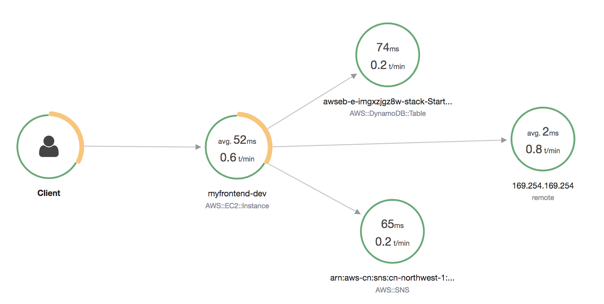
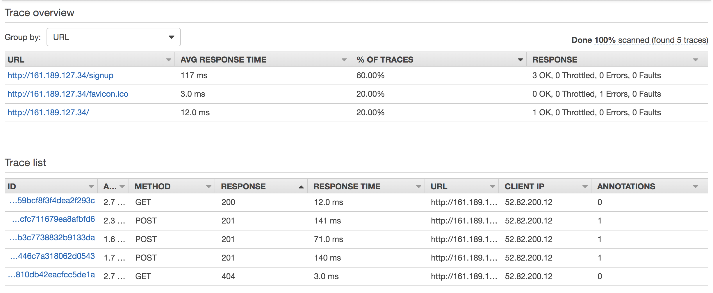
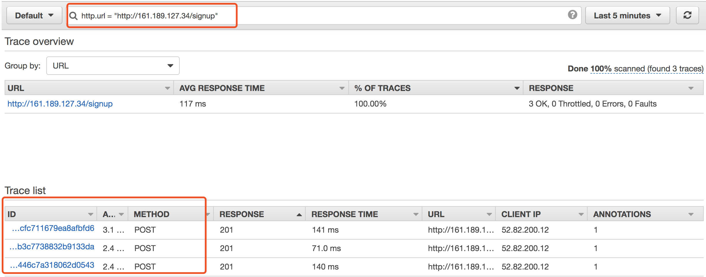
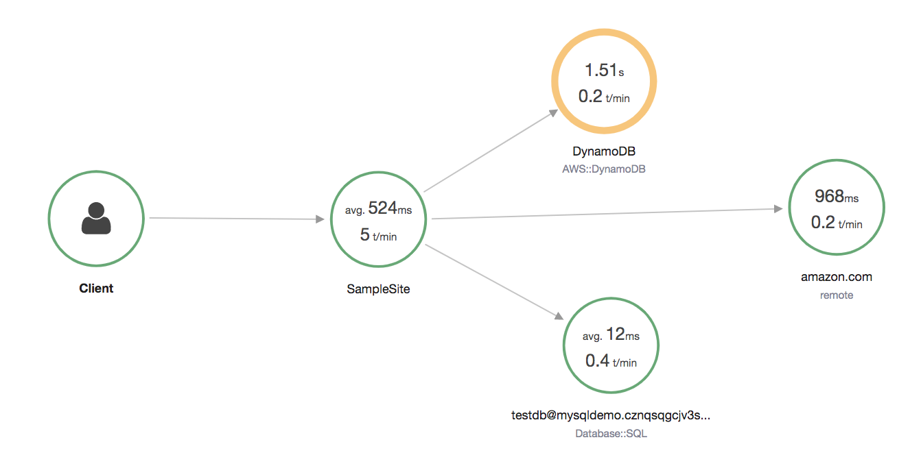
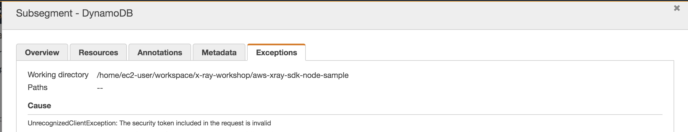

# Nodejs Express Sample App Instrumented with AWS X-Ray Running on EC2

## Let's check the sample code use the x-ray in AWS Beanstalk

This sample application uses the Express framework and Bootstrap to build a simple, scalable customer signup form that is deployed to AWS Elastic Beanstalk. The application stores data in Amazon DynamoDB and publishes notifications to the Amazon Simple Notification Service (SNS) when a customer fills out the form.

https://github.com/aws-samples/eb-node-express-sample/tree/xray

1. To enable the X-Ray, add the SDK to your application's dependencies.
*package.json*
```json
"aws-xray-sdk" : "1.1.2"
```

2. Initialize the X-Ray SDK client and add it to your application prior to declaring routes.
- XRay.getSegment(): retrieve the current segment or subsegment
- AWSXRay.captureFunc(): create a new nested subsegment and exposes it. The segment closes automatically when the function finishes executing and returns the result if any. 
- AWSXRay.captureAsyncFunc: creates a new nested subsegment and exposes it. This is async function that takes a single subsegment argument and returns the promise by executing the function. The segment must be closed using subsegment.close() the asynchronous function completes successfully.
- XRay.express.closeSegment(): close segment
- XRay.express.openSegment(): open segment to prepare collect the instument trace 

https://docs.aws.amazon.com/xray-sdk-for-nodejs/latest/reference/

```javascript
// Include the AWS X-Ray Node.js SDK and set configuration
var XRay = require('aws-xray-sdk');
var AWS = XRay.captureAWS(require('aws-sdk'));
var http = XRay.captureHTTPs(require('http'));

// Configure
XRay.config([XRay.plugins.EC2Plugin, XRay.plugins.ElasticBeanstalkPlugin]);
XRay.middleware.setSamplingRules('sampling-rules.json');
XRay.middleware.enableDynamicNaming();
```
3. Use the SDK exceptions after declaring routes.

```javascript
// open segment to prepare collect the instument trace 
var app = express();
app.use(XRay.express.openSegment('myfrontend'));

// capture function call
app.get('/', function(req, res) {
        XRay.captureAsyncFunc('Page Render', function(seg) {
            res.render('index', {
                static_path: 'static',
                theme: process.env.THEME || 'flatly',
                flask_debug: process.env.FLASK_DEBUG || 'false'
            });
            seg.close();
        });
        
        res.status(200).end();
    });

// instument adding the infomation in segment by seg.addAnnotation
app.post('/signup', function(req, res) {
        var seg = XRay.getSegment();
        seg.addAnnotation('email', req.body.email);
        seg.addAnnotation('theme', req.body.theme);
        seg.addAnnotation('previewAccess', req.body.previewAccess);

        // You logig
});

// close segment
app.use(XRay.express.closeSegment());
```

## Deploy the sample application via X-Ray console or Beanstalk CLI
1. Deploy by CLI
```bash
# Create an IAM Instance Profile named aws-elasticbeanstalk-sample-role with the policy in iam_policy.json. 

# interactive initialize
eb init

# creation EB environment
eb create --instance_profile aws-elasticbeanstalk-sample-role -r <AWS_REGION>

# cleanup
eb terminate --all
```

2. Find the ElasticBeanstalkEnvironmentURL key. Copy the value into your web browser to visit the sample application.

3. Check to the service map.



4. Check the traces



5. Filter the traces



## Run the AWS X-Ray on EC2 linux
1. Install X-Ray daemon
```bash
#!/bin/bash
curl https://s3.dualstack.us-west-2.amazonaws.com/aws-xray-assets.us-west-2/xray-daemon/aws-xray-daemon-2.x.rpm -o /home/ec2-user/xray.rpm
sudo yum install -y /home/ec2-user/xray.rpm

tail -f /var/log/xray/xray.log
```

2. Open security group for 2000(TCP/UDP), 3306(TCP), 3000(TCP) ports

3. IAM permission for EC2 instance profile
- AWSXrayFullAccess
- AmazonS3FullAccess
- AmazonDynamoDBFullAccess
- AmazonRDSFullAccess

3. Create RDS MySQL

```bash
mysql -h <RDS_Endpoint> -P 3306 -u dbadmin -p
# Create a table
# Insert rows in table
```
Then populate mysql-config.json with the required information

4. Run the application

Note: NPM and Node 10+ installed

```bash
export AWS_DEFAULT_REGION=cn-northwest-1

git clone https://github.com/aws-samples/aws-xray-sdk-node-sample.git
cd aws-xray-sdk-node-sample
npm install
node index.js
```

5. access the EC2 or ALB
- Visit your web browser to visit the sample application.
    - Test a traced AWS SDK request
    - Test a traced HTTP request.
    - Test a traced MySQL query.
- Check to the service map.



You can also drill down the invocation error


