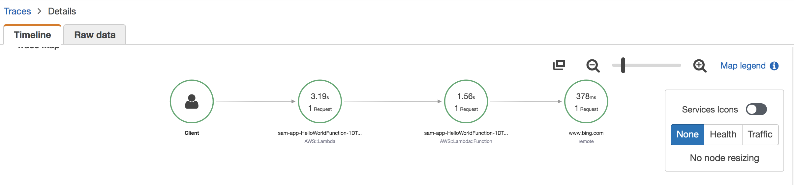
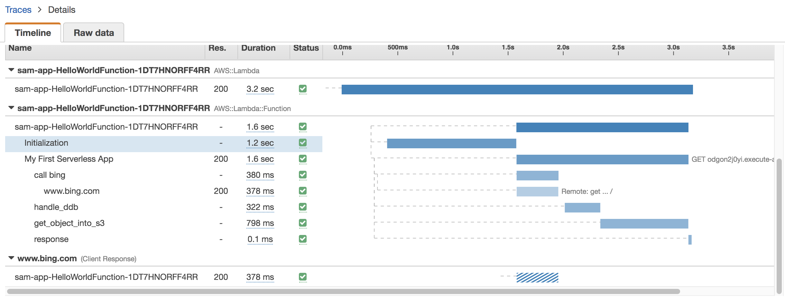
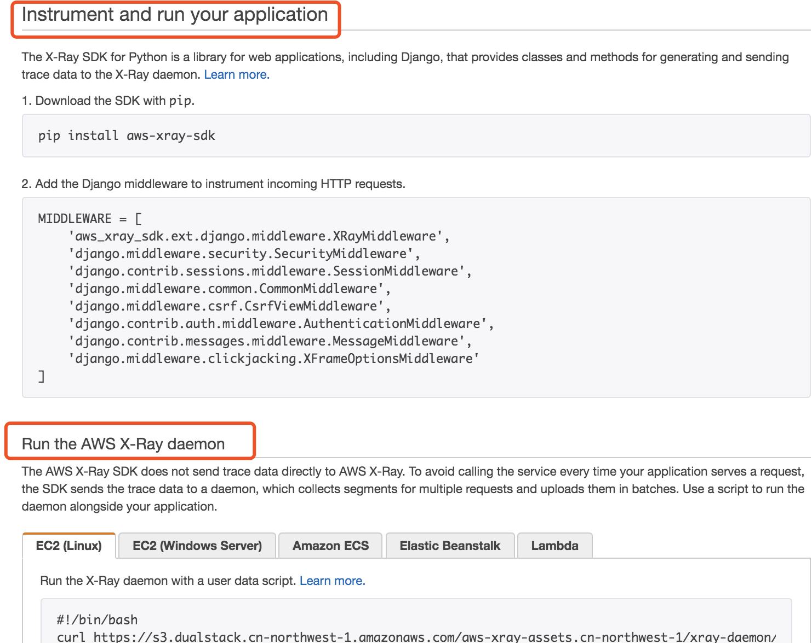

# AWS X-Ray support for Python web frameworks used in Serverless applications Running on Lambda and API Gateway

In the document, I deploy a Python web application with lambda and have AWS X-Ray automatically instrument the web frameworks so that I can track the internal requests. Then we can see the end-to-end service map view of all the downstream calls made starting from Amazon API Gateway, to Lambda, and all through the downstream calls that your web application makes.

Right now supported python web framework are Flask and Django.

## Setting up your serverless application
1. Install SAM
```bash
# 1. follow up the https://mirror.tuna.tsinghua.edu.cn/help/homebrew/ to instal the  Homebrew
brew --version

# Install the AWS SAM CLI
brew tap aws/tap
sudo yum install perl-devel
brew install aws-sam-cli
sam --version
brew upgrade aws-sam-cli
```
1. Prepare the environment
```bash
sam init --name serverless_application
cd serverless_application

virtualenv serverless_env
source serverless_env/bin/activate

# Install X-Ray, Flask into our environment
pip install aws_xray_sdk flask requests boto3 aws-wsgi
```

2. app.py

This application instruments the requests module, patches the Flask application’s middleware.

```python
# Import the X-Ray modules
from aws_xray_sdk.ext.flask.middleware import XRayMiddleware
from aws_xray_sdk.core import patcher, xray_recorder
from flask import Flask
import requests
import boto3
from botocore.exceptions import ClientError
from boto3.dynamodb.conditions import Key, Attr
import decimal
import json
import os
import awsgi

CURRENT_REGION = os.environ["AWS_REGION"]
s3_client = boto3.client(
    's3',
    region_name=CURRENT_REGION
)

dynamodb_client = boto3.client('dynamodb', region_name=CURRENT_REGION)

# Patch the requests module to enable automatic instrumentation
patcher.patch(('requests',))

app = Flask(__name__)

# Configure the X-Ray recorder to generate segments with our service name
xray_recorder.configure(service='My First Serverless App')

# Instrument the Flask application
XRayMiddleware(app, xray_recorder)

@app.route('/')
def hello_world():
    resp = requests.get("https://aws.amazon.com")
    return 'Hello, World: %s' % resp.url

# Use decorators to automatically set the subsegments
@xray_recorder.capture('get_object_into_s3')
def get_object_into_s3():
    try:
        response = s3_client.download_file(
            "aws-xray-assets.cn-northwest-1", "samples/aws-xray-sample-template.yaml", "/tmp/aws-xray-sample-template.yaml")
        xray_recorder.current_subsegment().put_annotation('put_response', status_code)
    except ClientError as e:
        print(e)
        return {
            'statusCode': 500,
            'body': 's3 operation failed: ' + e.response['Error']['Message']
        }

# Define subsegments manually
def handle_ddb():
    xray_recorder.begin_subsegment('handle_ddb')
    DDB_TABLE_NAME = 'Movies'
    try:
        response = dynamodb_client.describe_table(TableName=DDB_TABLE_NAME)
    except dynamodb_client.exceptions.ResourceNotFoundException:
        try:
            table = dynamodb_client.create_table(
                TableName=DDB_TABLE_NAME,
                KeySchema=[
                    {
                        'AttributeName': 'year',
                        'KeyType': 'HASH'  # Partition key
                    },
                    {
                        'AttributeName': 'title',
                        'KeyType': 'RANGE'  # Sort key
                    }
                ],
                AttributeDefinitions=[
                    {
                        'AttributeName': 'year',
                        'AttributeType': 'N'
                    },
                    {
                        'AttributeName': 'title',
                        'AttributeType': 'S'
                    },

                ],
                ProvisionedThroughput={
                    'ReadCapacityUnits': 5,
                    'WriteCapacityUnits': 5
                }
            )
            dynamodb_client.get_waiter('table_exists').wait(TableName=DDB_TABLE_NAME)
            print("Table status:", table)
        except ClientError as e:
            print(e)
            return {
                'statusCode': 500,
                'body': 'create ddb table Movies failed: ' + e.response['Error']['Message']
            }
        pass
        

    title = "The Big New Movie"
    year = 2015

    try:
        response = dynamodb_client.put_item(
            TableName=DDB_TABLE_NAME,
            Item={
                'year': {'N': str(year)},
                'title': {'S': title},
                'info': {
                    'M':{
                        'plot': {'S': "Nothing happens at all."},
                        'rating': {'N': str(decimal.Decimal(0))}
                    }
                }
            }
        )
        print("PutItem succeeded:")
        print(json.dumps(response, indent=4))
        xray_recorder.current_subsegment().put_annotation('get_response', response)
    except ClientError as e:
        print(e)
        return {
            'statusCode': 500,
            'body': 'ddb put_item failed: ' + e.response['Error']['Message']
        }


    try:
        response = dynamodb_client.get_item(
            TableName=DDB_TABLE_NAME,
            Key={
                'year': {'N': str(year)},
                'title': {'S': title}
            }
        )
        item = response['Item']
        print("GetItem succeeded:")
        print(json.dumps(item, indent=4))
    except ClientError as e:
        print(e)
        return {
            'statusCode': 500,
            'body': 'ddb get_item failed: ' + e.response['Error']['Message']
        }
    xray_recorder.end_subsegment()

@app.route('/app')
def hello_app():
    xray_recorder.begin_segment('hello_app')

    # bing
    xray_recorder.begin_subsegment('call bing')
    resp = requests.get("https://www.bing.com")
    print('Hello, app: %s' % resp.url)
    xray_recorder.end_subsegment()

    # s3 
    get_object_into_s3()
    
    # DynamoDB
    handle_ddb()
    
    # response
    xray_recorder.begin_subsegment('response')
    body = {
        "message": "Go Serverless v1.0! Your function executed successfully!"
    }

    response = {
        "statusCode": 200,
        "body": json.dumps(body)
    }

    xray_recorder.end_subsegment()
    xray_recorder.end_segment()

    return response

def lambda_handler(event, context):
    return awsgi.response(app, event, context)
```

2. AWS::Serverless::Function
Tracing: specifies the function's X-Ray tracing mode: Active or PassThrough

```yaml
Resources:
  HelloWorldFunction:
    Type: AWS::Serverless::Function # More info about Function Resource: https://github.com/awslabs/serverless-application-model/blob/master/versions/2016-10-31.md#awsserverlessfunction
    Properties:
      CodeUri: hello_world/
      Handler: app.lambda_handler
      Runtime: python3.7
      Tracing: Active
      Events:
        HttpGet:
          Type: Api
          Properties:
            Path: '/'
            Method: GET
        HttpGetProxy:
          Type: Api
          Properties:
            Path: '/{proxy+}'
            Method: GET
```

3. requirements.txt
```bash
requests
aws-xray-sdk 
flask
boto3
aws-wsgi
```

4. deploy commands
```bash
# deploy applicaiton
sam build --region ${AWS_REGION}
sam deploy --guided
curl {HelloWorldApi_URL}

# You can also 
# mkdir package && cd package
# pip install aws_xray_sdk -t ./
# pip3 install flask -t ./
# pip install requests -t ./
# pip install boto3 -t ./
# pip install aws-wsgi -t ./
# chmod -R 755 .
# zip -r9 ../function.zip .

# cd ..
# zip -g function.zip app.py

# aws lambda create-function --function-name xray-flask-demo \
# --zip-file fileb://function.zip --handler app.lambda_handler --runtime python3.7 \
# --role arn:aws-cn:iam::876820548815:role/lambda_basic_execution \
# --tracing-config Mode=Active --region ${AWS_REGION}

# aws lambda update-function-code --function-name xray-flask-demo \
# --zip-file fileb://function.zip --region ${AWS_REGION}

# aws lambda invoke --region ${AWS_REGION} --function-name xray-flask-demo out --log-type Tail \
# --query 'LogResult' --output text |  base64 -d

# aws lambda delete-function --function-name xray-flask-demo
```

## Check the X-Ray tracing
We can see the service map from API Gateway to Lambda and to the remote URL



Then we can drill down the Lambda invocation the S3 and DynamoDB and call remote "bing.com" url at the downstream invocation



Django instrument




## Cleanup
```bash
sam deploy
aws cloudformation describe-stacks --stack-name serverless_application --region ${AWS_REGION} \
--query "Stacks[].Outputs"
aws cloudformation delete-stack --stack-name serverless_application --region ${AWS_REGION}
```