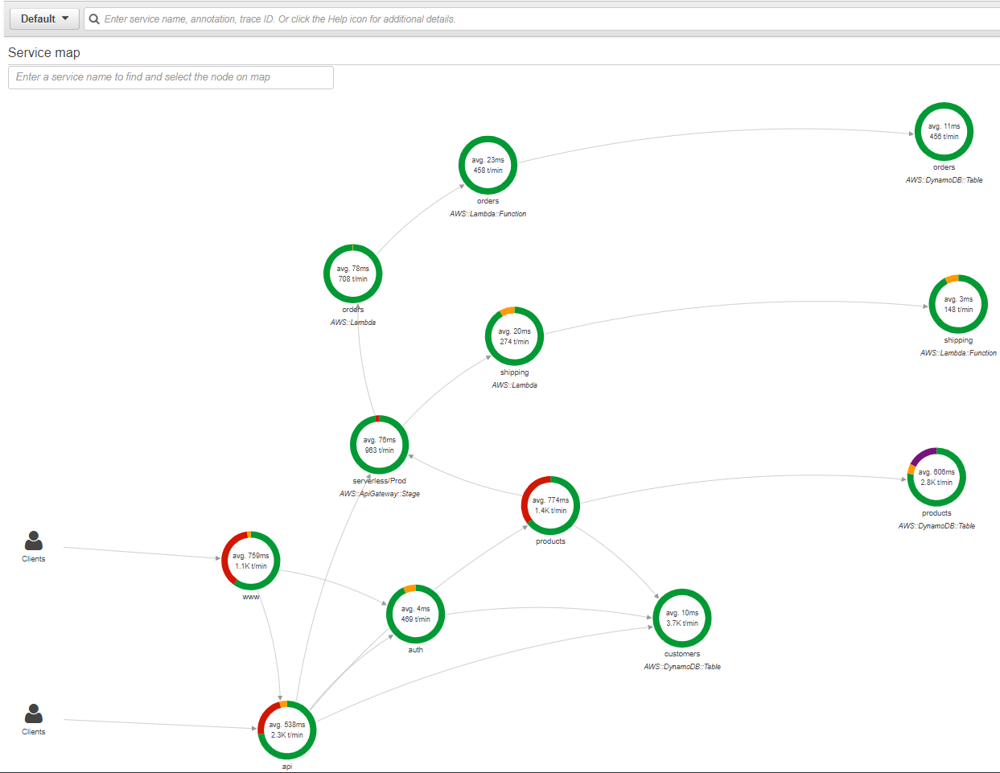
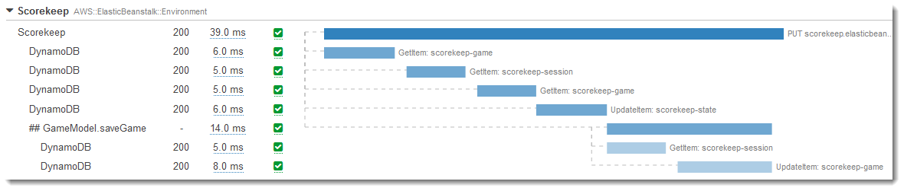

# aws-xray-workshop-gcr

AWS X-Ray is a service that collects data about requests that your application serves, and provides tools you can use to view, filter, and gain insights into that data to identify issues and opportunities for optimization.

You can use AWS X-Ray tracing application makes to downstream AWS resources, microservices, databases and HTTP web APIs to visualize the components of your application, identify performance bottlenecks, and troubleshoot requests that resulted in an error. 

The X-Ray architecture include
- X-Ray deamon
- X-Ray SDK
- X-Ray API and other client
- X-Ray Console

1. The X-Ray SDK provides:

- Interceptors to add to your code to trace incoming HTTP requests
- Client handlers to instrument AWS SDK clients that your application uses to call other AWS services
- An HTTP client to use to instrument calls to other internal and external HTTP web services

2. X-Ray deamon listening traffic and buffers segments and upload to X-Ray in batches

Instead of sending trace data directly to X-Ray, the SDK sends JSON segment documents to a daemon process listening for UDP traffic. The X-Ray daemon buffers segments in a queue and uploads them to X-Ray in batches. The daemon is available for Linux, Windows, and macOS, and is included on AWS Elastic Beanstalk and AWS Lambda platforms.

3. X-Ray API: provides access to all X-Ray functionality through the AWS SDK, AWS CLI, or HTTPS request.

4. X-Ray Console show the tracing graph and drill down analysis

## Key Concept
- Segment

The data collected at each point is called a segment, and is stored as a chunk of JSON data. A segment represents a unit of work, and includes request and response timing, along with optional `sub-segments` that represent smaller work units.

- Traces

The groups of segments that share a common ID. 

- Service graphs

Processed from traces to visually depict the relationship of services to each other and performance and status statistics.

- Sampling

To ensure efficient tracing and provide a representative the requests statistics, the X-Ray SDK applies a sampling algorithm to determine which requests get traced. By default, the X-Ray SDK records the first request each second, and five percent of any additional requests. You can configure X-Ray to modify the default sampling rule and sampling rate.

- Filter expressions

You can drill down to traces for individual requests, or use filter expressions to find traces related to specific paths or users.

## Supported languages and frameworks
- AWS X-Ray SDK for .NET: .NET on Windows Server, C# .NET Core on AWS Lambda
- AWS X-Ray SDK for Go: Go web applications, Go on AWS Lambda
- AWS X-Ray SDK for Java: Tomcat, Spring Boot, Java on AWS Lambda, Manually create a segment for each incoming request
- AWS X-Ray SDK for Python: Django or Flask, Python on AWS Lambda, Manually create a segment for each incoming request
- AWS X-Ray SDK for Node.js: Express or Restify, Node.js on AWS Lambda, Manually create a segment for each incoming request
- AWS X-Ray SDK for Ruby: Rails, Manually create a segment for each incoming request

## Supported AWS services
- Lambda
- API Gateway
- EC2
- Elastic Beanstalk
- Step Function

## Code and configuration changes
1. A large amount of tracing data can be generated without any functional changes to your code. 
2. Detailed tracing of front-end and downstream calls requires only minimal changes to build and deploy-time configuration.

For example: 
- AWS resource configuration - Turn on the X-Ray
- Build configuration – Take X-Ray SDK for Java submodules as a compile-time dependency
- Application configuration:
  - To instrument incoming HTTP requests, add a servlet filter to your Java application, 
  - Use the X-Ray SDK for Node.js as middleware on your Express application. 
  - Change sampling rules and enable plugins to instrument the Amazon EC2, Amazon ECS, and AWS Elastic Beanstalk resources that run your application.
- Class or object configuration – To instrument outgoing HTTP calls in Java, import the X-Ray SDK for Java version of HttpClientBuilder
- Functional changes 
  - Add a request handler to an AWS SDK client to instrument calls that it makes to AWS services. 
  - Create subsegments to group downstream calls, and add debug information to segments with annotations and metadata.

## Example hands on
1. [Nodejs Express Sample App Instrumented with AWS X-Ray Running on EC2](Nodejs-Example.md)
2. [AWS X-Ray support for Python web frameworks used in Serverless applications Running on Lambda and API Gateway](Pyhton-Example.md)
3. [AWS X-Ray SDK for Java](Java-Example.md)
4. [.Net with AWS X-Ray](Net-Example.md)
5. [Application Tracing on Kubernetes with AWS X-Ray](EKS-XRay.md)
6. [Run AWS X-Ray as a sidecar container on Fargate for application tracing](ECS-Fargate-XRay.md)
